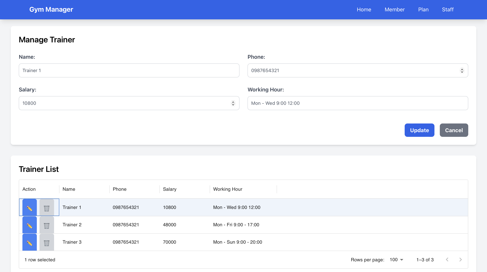

# Project Name: Gym Manager
https://wad-project-2.vercel.app/

# Member
Sai Aik Sei Mouk https://github.com/SaaiLeo/SaaiLeo.github.io  
Sai Thaw Zin Aung https://github.com/Aris823/Aris823.github.io.git  
Yel Lin https://github.com/Yellin21/yellin21.github.io 

# Description
In this project, we build a web application for gym management. In this application, we have three data models which are Member, Staff and Plan. 

# Home Page
A manager can select the category which he want to manage. Example Staff page(Trainers), Member page (Customers) and Plan page (Subscription plan).

# Subscription Page
In our subscription page, all the subsription plan and details such as plan name, price and duration will be shown. Additionally, the manager can create new subscription plan. He can enter the plan name, how much it will cost and the duration of that plan in month. The manager can also edit and delete existing plan.

# Staff Page
In our staff page, all staff and details such as name, phone number, monthly salary and working hours will be displayed. Just like subscription page, the manager can create new staff. He can set the staff name, phone number, monthly salary and working hours. The manager can edit and delete existing staff as well.

# Member Page
In our member page, all existing members will be shown. Details such as member's name, phone number, age, height, weight, subscription plan, plan start date and plan end date, associated trainer are also displayed. In order to create new member, the manager have to fill in member name, phone number, age, height, weight, plan, select starting date and the trainer. The plan and trainer options are based on the subscription plans created. After the manger select start date with date picker, the end date will automatically set based on the duration specified in the selected Plan. Moreover, the manager can edit and delete the existing member.

# Bonus
A navigation bar is added to allow user to navigate between pages easily. Moreover, we have added filtering features for better UX.

